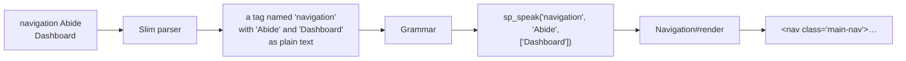

# Slim-Pickins — a primer

A plain introduction to the language abide's views are written in.
[`SPEC.md`](SPEC.md) is the contract; this is the tour.

## The idea in one paragraph

A template should say **what is on the page**, not how to build it. `Accounts`
is a thing. `<div class="sp-cluster sp-cluster--between">` is scaffolding. This
library exists so that views hold only the first kind of line, and every piece
of scaffolding lives in one place where it can be fixed once.

## Two ways to say something

There are exactly two, and the difference is worth learning early.

**Call a helper** when the thing needs Ruby — a value, a hash, a block of other
content:

```slim
= ui_card "Create New Account" do
  p Anything you like in here.
```

**Speak a word** when the thing is just itself:

```slim
navigation Abide
    Dashboard
    Accounts
    Portfolios
```

No `=`, no `ui_`, no quotes, no commas. A word is a component you *say*.

Here is what the second one replaced:

```slim
nav.main-nav
  .container
    .sp-cluster.sp-cluster--between.sp-nav-bar
      a.brand href="/" Abide
      .nav-links
        a href="/" class=(request.path == '/' ? 'active' : '') Dashboard
        a href="/accounts" class=(request.path == '/accounts' ? 'active' : '') Accounts
        a href="/portfolios/manage" class=(request.path == '/portfolios/manage' ? 'active' : '') Portfolios
```

Same HTML, to the byte. Eight lines became four, and four levels of nesting
became one.

## How a spoken line becomes HTML



`Grammar` is a filter that runs while the template compiles — once, in memory,
the first time a page is rendered. There is no build step and no new file
format. Slim is still Slim; the grammar only intercepts words it knows.

## The six laws

Everything the language does follows from these. Each one deletes a kind of
line you would otherwise have written by hand.

### 1. A line names a thing, never a box

If a line names an HTML element, a CSS class, or a layout, it is in the wrong
file. Views hold nouns from abide's world: accounts, portfolios, movements.

### 2. A word owns its box

The caller never writes the wrapper.

```slim
navigation Abide          ← says what it is
```
```slim
nav.main-nav              ← the word writes all of this itself
  .container
    .sp-cluster…
```

### 3. The argument is the subject

What follows the word is the one thing that makes this instance itself — not a
setting.

```slim
navigation Abide      ✓  Abide is the site
navigation wide       ✗  that is a setting, not a subject
```

### 4. Children mean whatever the word says they mean

The indented lines are a list that *this word* interprets. Under `navigation`,
`Dashboard` is a destination. Under some other word the same line would mean
something else. Nothing generic happens to it.

### 5. Anything derivable is derived

If the word can work it out, the caller must not pass it.

```slim
a href="/" class=(request.path == '/' ? 'active' : '')   ← before
Dashboard                                                ← after
```

The word can see the request, so it knows which page you are on. The same law
covers a selected `<option>`, a disabled button, and an empty list saying so.

### 6. A label is a caption and a key at once

`Dashboard` is both the text a reader sees and the identity of the page it
leads to. That is what lets the URL disappear.

Where a label cannot produce its path, the exception is declared once, in the
word — never repeated in the view:

```ruby
PATHS = {
  "Dashboard"  => "/",
  "Portfolios" => "/portfolios/manage"
}.freeze
```

## Lists, and the plural

A word named after a model, in the plural, names the whole list:

```slim
accounts
    Name
    Type
    Balance
    Actions
```

That is the accounts table — thirty lines of template before this. The plural
is doing real work. From the single word `accounts`, the word knows:

| It knows | Because |
|---|---|
| the collection is `@accounts` | the route prepared it under that name |
| each row lives at `/accounts/:id` | the model's path is its name |
| the row wiring is `crud-actions` | it follows from that path |

Nothing is passed in. A convention you have to restate is not one.

The lines beneath name the **aspects** of one account that this list shows,
and their order is the order they appear in. An aspect is not a column — a
table draws it as a column, but a grid of cards would draw it as a region, and
the view does not say which. That is the word's business.

An aspect label is also not a key into the data. `Balance` is not
`account['balance']`; it is a question for the ledger, formatted as money and
right-aligned. The word keeps that table:

```ruby
CELLS = {
  "Name"    => :editable_name,
  "Type"    => :kind,
  "Balance" => :balance,
  "Actions" => :actions
}.freeze
```

Ask for an aspect the word does not have and it says so, naming the ones it
does.

## The vocabulary you call

Helpers, for the things that need Ruby. All of them return escaped, safe
markup.

| Say this | To get |
|---|---|
| `ui_card "Title" do` | a contained surface, the basic grouping element |
| `ui_flash :notice, "Saved"` | a message that dismisses itself |
| `ui_button "Save", :primary` | a button, or a link when given `href:` |
| `ui_text_field "name", value` | a field you edit in place |
| `ui_field "Label" do` | a labelled form control |
| `ui_table headers, rows` | a data table |
| `ui_modal title: "…" do` | a dialog, with `ui_modal_trigger` to open it |
| `ui_sortable_list do` | a list you can drag into order |
| `ui_toggle_panel "More" do` | a native `<details>` panel |
| `ui_icon :trash` | one inline SVG from a small set |
| `ui_pill "asset"` | a small text pill |
| `ui_badge "3"` | a round status indicator |
| `ui_well do` | an inset region |
| `ui_code source` | source shown literally |
| `ui_summary do` | a rich summary line for a toggle panel |
| `ui_money amount` | an amount as money; `sign: true` spells out `+` or `-` |

## Layout, in classes rather than helpers

Views write these directly, because a wrapper with no behaviour does not need a
helper:

| Class | Meaning |
|---|---|
| `.sp-stack` | children in a column |
| `.sp-cluster` | children in a row |
| `.sp-grid` | children in a grid |
| `.sp-list` | rows that do nothing |
| `.sp-page` | the page frame |
| `.sp-nav` | a nav bar |
| `.sp-input` | a form control |

Add `--tight`, `--loose`, `--start`, `--between` to a stack or cluster to change
its spacing or alignment.

## Escaping, in one paragraph

Content is escaped unless it is markup by construction. Helpers return a
`SafeString`, so nesting one inside another passes through untouched, while a
plain String — from a user, the database, or you typing prose — is escaped on
the way in. Attribute values are always escaped. If you have a literal String
that really is HTML, vouch for it with `sp_safe`. One catch worth remembering:
Ruby loses the safe marking across `+`, `join`, and `"#{}"`, so a helper that
glues strings together re-marks the result itself.

## Writing a new word

One file. Subclass `Word`, and write `render`.

```ruby
class Navigation < SlimPickins::Word
  def render
    tag(:nav, class: "main-nav") do
      tag(:div, class: "nav-links") { safe(items.map { |i| link(i) }.join) }
    end
  end
end
```

You get two things:

- `subject` — the text after the word (`"Abide"`)
- `items` — the indented lines beneath it (`["Dashboard", "Accounts"]`)

A list of things is a `Collection` instead, named for its model in the plural.
It adds `members`, `path`, `path_for`, and `empty?`, all worked out from the
name:

```ruby
class Accounts < SlimPickins::Collection
  def render = tag(:table, class: "sp-table") { safe(head + body) }
end
```

The spoken name comes from the class name, so `Navigation` is spoken as
`navigation` and `Accounts` as `accounts`. Nothing needs registering; the
grammar finds it.

## Two ways to write the lines beneath

Whether you give a word a subject changes how Slim reads its block, so pick
the one that reads better and know what you get:

```slim
navigation Abide          with a subject: the lines are free text,
    Dashboard             so an item can be any phrase.

accounts                  without one: the lines are parsed,
    Name                  so an item is a single name.
    Balance
```

Both arrive as `subject` and `items`. The second form can also carry a word
after the name — `Balance numeric` reads as one item, `"Balance numeric"` —
though nothing uses that yet.

Words an application owns live with that application — `abide/words/` — and
must be required before any template renders.

## Where the language stops

Worth knowing before you fight it.

**A word takes a subject or parsed children, never both.** Supplying the
subject is exactly what makes Slim stop parsing the lines beneath it. You get
items either way, but not a subject *and* multi-word items from one line.

**An item may not have children of its own.** Nesting under an item raises
while the template compiles, saying which item did it. Better a loud error
than a line that quietly renders nothing.

**Items are text, not objects.** A word cannot be handed a row from the
database. A `Collection` sidesteps this by finding its own data from its name,
and `#{...}` still interpolates, but there is no way to pass an object in.

**A word cannot take options.** No `navigation Abide, wide: true`. If two
variants are needed, that is two words, or a component with a helper.

**A misspelled word fails quietly.** `navigatoin Abide` is not vocabulary, so
the grammar leaves it alone and Slim renders `<navigatoin>` — an unknown
element, invisible on the page. If a word seems to do nothing, check its
spelling first.

The rule when you hit one of these: grow the language. Never work around it in
the view.
